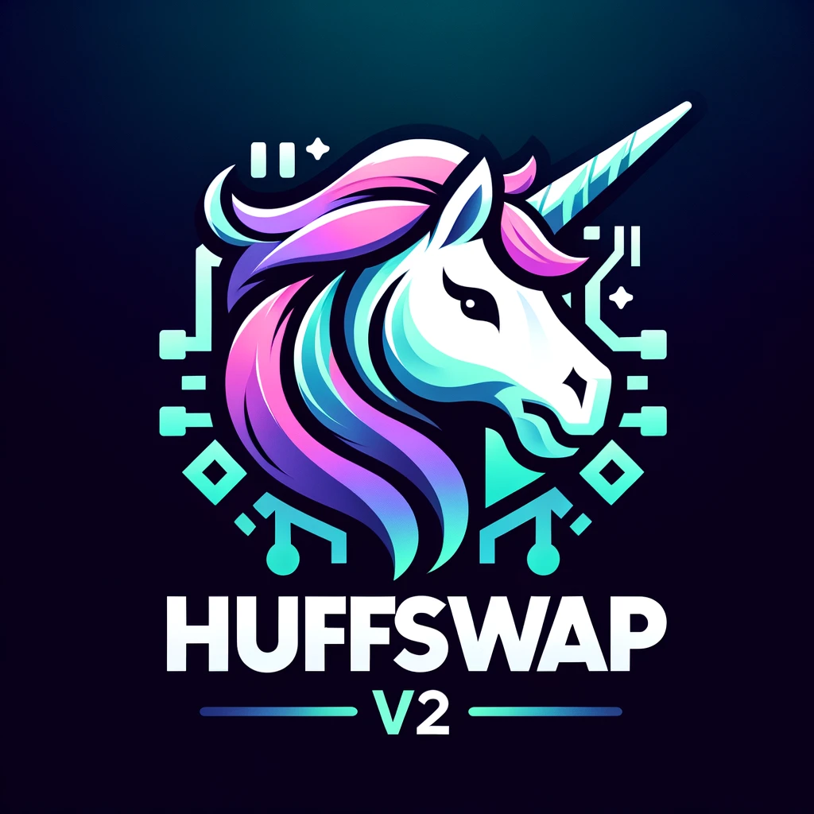

<center>
  
</center>

# HuffSwap 
**A Simple DEX with BALLs**

## HuffSwap V2 Core

HuffSwap V2 Core is a decentralized trading protocol that facilitates permissionless and trustless trading of ERC20 tokens through smart contracts. Its based on Uniswap V2, and should be compatible.

## Previous Work

This project builds upon the [UniswapV2-core](https://github.com/Uniswap/v2-core/) contracts and maintains full compatibility. It also draws inspiration from previous efforts to rebuild the pair contract in Huff, such as [UniswapV2-Huff](https://github.com/AmadiMichael/UniswapV2-Huff/).

### Prerequisites

These steps are optional if you want to modify the Pair code and recompile everything.

1. Install [BALLs](https://github.com/Philogy/balls/tree/main)
2. Install [Huff](https://github.com/huff-language/huff-rs?tab=readme-ov-file#installation)

### Recompilation

To recompile the contracts, run the following commands:

```bash
sh build-erc20.sh
sh build-erc1363.sh
sh build-libs.sh
sh build-lp.sh
sh create-bytecode-pair.sh
```

After recompiling, paste your new bytecode into [`Factory:getCreationCode`](https://github.com/eugenioclrc/huffswap-v2-core/blob/7b7572305d2ccce80c0d431beeba8948d9491080/src/Factory.sol#L32).

### Setup Instructions

To get started with HuffSwap V2 Core, ensure you have Foundry installed. Follow these steps:

1.  Clone the HuffSwap V2 Core repository:

```bash
git clone https://github.com/eugenioclrc/huffswap-v2-core.git
```

2.  Navigate to the project directory:

```bash
cd huffswap-v2-core
```

3.  Install dependencies:

```bash
forge update
```

4.  Build the project:

```bash
forge build
```

5.  Run tests to ensure everything is set up correctly:

```bash
forge test
```

Contributing
------------

We welcome contributions from the community! To contribute, please follow these steps:

1.  Fork the repository.
2.  Create a new branch for your feature or bugfix.
3.  Make your changes.
4.  Submit a pull request with a detailed description of your changes.

License
-------

HuffSwap V2 Core is released under the MIT License.

Contact
-------

For questions or support, please open an issue in this repository or [reach out me on twitter](https://twitter.com/eugenioclrc).

